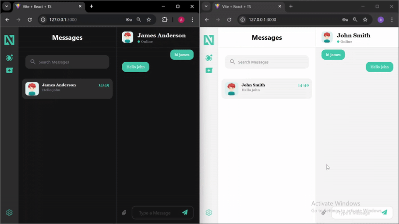

# Neochat

## About
This is a chat application that has a frontend built with Jetpack Compose for Android and React with typescript for web app and a backend built with Ktor, which uses PostgreSQL as the database.

## Table of Contents
- [Bult using](#bult-using)
- [Server setup prerequisite](#server-setup-prerequisite)
- [Db structure](#db-structure)
- [Api documentation](#api-documentation)
- [React web app setup](#react-web-app-setup)
- [Room for improvement](#room-for-improvement)
- [Upcoming Features and Enhancements](#upcoming-features-and-enhancements)
- [Current Demo](#current-demo)

### Bult using

* **Backend**
  - kotlin
  - ktor 
  - postgres
  - Exposed Library
  - JWT 
  - Web socket
    
* **Frontend Android**
  - kotlin
  - Jetpack compose
  - Paging2 library
  - Okhttp3 library
  - Retrofit
  - Datastore Preference

* **Frontend Web**
  - Typescript
  - React
  - Vite
  - CSS/ HTML
  - Websocket

### Server setup prerequisite
 - Postgres must be installed with user and password as "postgres" and "postgres" respectively or change these in DatabaseFactory.kt
 - Create a table "neochat" in db or you can define your own in DatabaseFactory.kt
 - Add environment variable JWT_SECRET=anything in android studio

### Db structure


### Api documentation
 - Import this collection in postman - [Collection](./Files/neochat.json)
 - For description of the api click on this icon in postman
   
 - Api for sending message
   

### React web app setup
- Node js must be installed
- Clone the project with
```
https://github.com/AnuragDevMastermind/Chat-application.git
```
- Navigate to the directory
```
cd NeoChatWeb
```
- Install the dependencies with
```
npm i
```
- run with
```
npm run dev
```


### Room for improvement

* **Server side**
  - Apis access should be denied without authentication

* **Frontend side**
  - offline caching
 
### Upcoming Features and Enhancements
 - Support for all type of media
 - User will be able to edit and delete the message
 - Compose Multiplatform for IOS app

### Current Demo


